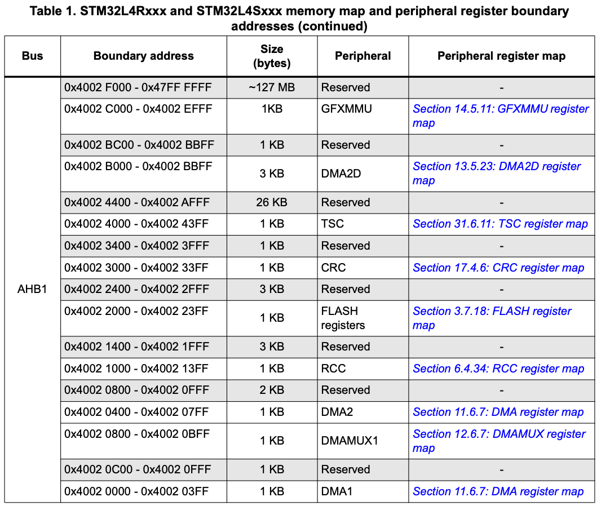
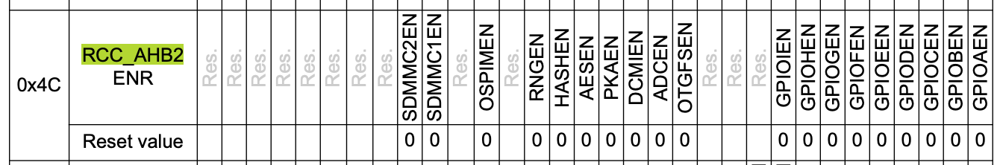
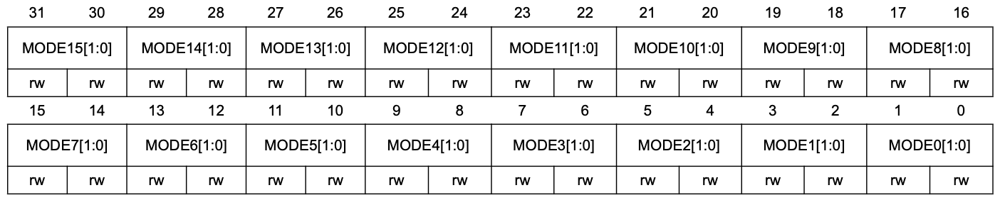
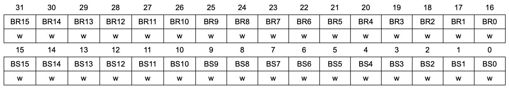

<script type="text/javascript" src="https://cdn.jsdelivr.net/npm/mathjax@3/es5/tex-mml-chtml.js"></script>

# Recitation 4

# Introduction to Memory Mapped I/O, ADC and DAC with Example Exercises

## ADC (Analog-to-Digital Converter)

- Converts analog voltage (continuous) into a digital value that a microcontroller can understand.
- Allows the MCU to read sensor data like temperature, light, or position.

$$\text{Digital Value} = \left(\frac{V_{in}}{V_{ref}}\right) \times (2^N - 1)$$

Where:

- V_in: Input voltage
- V_ref: Reference voltage (usually 3.3 V on STM32)
- N: ADC resolution (12 bits for STM32 → range 0–4095)

**Example:** If V_in = 1.65V and V_ref = 3.3V:

$$\text{Digital Value} = \left(\frac{1.65}{3.3}\right) \times 4095 = 2047$$

---

> Note: User Manual Page no: 31/57 for list of analog pins

---

## Exercise 1: Basic ADC Read

Read analog voltage on pin A0 and print float (0.0–1.0) and raw (0–65535) values.

```cpp
#include "mbed.h"
AnalogIn analog_pin(A0); // A0 pin (PC5)

int main()
{
    while (true)
    {
        float value = analog_pin.read(); // Scaled:0.0-1.0
        //read() → Returns normalized voltage value
        uint16_t raw_value = analog_pin.read_u16(); // Raw: 0-65535
        // read_u16() → Returns full 16-bit resolution.
        printf("Analog float: %.3f, Raw: %u\r\n", value, raw_value);
        ThisThread::sleep_for(500ms);
    }
}
```

---

## Exercise 2: Multi-Channel ADC

Read analog signals from A0, A1, A2

```cpp
#include "mbed.h"
AnalogIn a0(A0); // PC5
AnalogIn a1(A1); // PC4
AnalogIn a2(A2); // PC3

int main()
{
    while (true)
    {
        printf("A0: %.2f, A1: %.2f, A2: %.2f\r\n", a0.read(), a1.read(), a2.read());
        ThisThread::sleep_for(1s);
    }
}
```

---

## Exercise 3: ADC + Digital Control

Control LED brightness or ON/OFF state based on an analog input (like a potentiometer).

```cpp
#include "mbed.h"
AnalogIn analog(A0); // Pin PC5
DigitalOut led(LED1); // Pin PA5 (LD1)

int main()
{
    const float threshold = 0.5f; // 50% of 3.3V
    while (true)
    {
        float value = analog.read();
        led = (value > threshold) ? 1 : 0; // LED ON if input > 1.65V
        printf("Value: %.2f, LED: %d\r\n", value, led.read());
        ThisThread::sleep_for(200ms);
    }
}
```

---

## DAC (Digital-to-Analog Converter)

- Converts digital values into voltage output.

**Output voltage range:**

$$V_{out} = \text{Digital Value} \times V_{ref}$$

**Example:** Writing 0.5 outputs ≈1.65 V if $$V_{ref} = 3.3V$$

---

## Memory-Mapped I/O (MMIO)

The Mbed API provides a high-level abstraction layer. The underlying mechanism enabling all hardware interaction is Memory-Mapped I/O (MMIO).

Memory-Mapped I/O (MMIO) is an architecture where hardware peripherals and main memory (RAM) share the same address space. In this system, the registers that control a peripheral (like an ADC, GPIO, or timer) are assigned to specific, fixed addresses in the microcontroller's memory map.

To communicate with the hardware, the CPU uses the exact same instructions it uses to read from and write to RAM (e.g., LDR and STR on ARM, or MOV on x86). When the CPU issues a read or write to an address mapped to a peripheral, the memory controller routes that command directly to the peripheral's hardware register instead of to a RAM chip. This method avoids the need for special, separate I/O instructions and simplifies the CPU's design.

In the ARM Cortex-M architecture, there is no separate I/O address space (like x86's "port I/O"). Instead, all peripherals are mapped to specific, fixed addresses within the main 32-bit system memory bus. This means the CPU communicates with hardware (GPIO, ADC, timers, UARTs) by executing standard load (LDR) and store (STR) assembly instructions.

Memory-Mapped I/O (MMIO) is the use of the CPU's standard memory access instructions to communicate with hardware peripherals. On an ARM Cortex-M CPU, this means:

- **MMIO Write:** Executed using an STR (Store Register) instruction. The CPU places a value onto the system's bus at a specific hardware address.
- **MMIO Read:** Executed using an LDR (Load Register) instruction. The CPU requests the value currently held at a specific hardware address.

These addresses do not point to RAM; they are direct connections to the peripheral's registers.

- **Control Registers** (e.g., ADC_CR): Used to configure peripheral behavior (e.g., set resolution, enable/disable, select channel). This is an MMIO Write.
- **Status Registers** (e.g., ADC_ISR): Used to read the hardware's state (e.g., EOC - End of Conversion bit, error flags). This is an MMIO Read.
- **Data Registers** (e.g., ADC_DR): A "mailbox" for transferring data. The CPU reads from ADC_DR to get the conversion result or writes to DAC_DHR12R1 to set the output voltage.

---

## Example 1: LED Blink using MMIO for STM32L4xx without Mbed HAL

```cpp
#include <stdint.h>
#define RCC_AHB2ENR ( *(volatile uint32_t *)(0x40021000 + 0x4C) )
// RCC (Reset and Clock Control)
// GPIOA (Port A)
#define GPIOA_MODER ( *(volatile uint32_t *)(0x48000000 + 0x00) )
#define GPIOA_BSRR  ( *(volatile uint32_t *)(0x48000000 + 0x18) )
#define LED_PIN 5
#define RCC_GPIOA_EN_BIT 0

int main(void) {
    // MMIO Write: Set bit 0 in the RCC_AHB2ENR to power on GPIOA
    RCC_AHB2ENR |= (1 << RCC_GPIOA_EN_BIT);

    // MMIO Write: Set the 2 bits for PA5 (bits 11:10) to "01" (Output)
    GPIOA_MODER &= ~(0b11 << (LED_PIN * 2)); // Clear bits
    GPIOA_MODER |=  (0b01 << (LED_PIN * 2)); // Set to Output

    while (1) {
        // MMIO Write: Turn LED ON (Set PA5)
        GPIOA_BSRR = (1 << LED_PIN);
        for (volatile int i = 0; i < 100000; i++); // Delay

        // MMIO Write: Turn LED OFF (Reset PA5)
        GPIOA_BSRR = (1 << (LED_PIN + 16));
        for (volatile int i = 0; i < 100000; i++); // Delay
    }
}
```

---

## Datasheet Reference

[STM32L4 Series Reference Manual](https://www.st.com/resource/en/reference_manual/rm0432-stm32l4-series-advanced-armbased-32bit-mcus-stmicroelectronics.pdf)






---

## 8.4.1 GPIO Port Mode Register (GPIOx_MODER) (x = A to I)

- **Address offset:** 0x00
- **Reset value:** 0xABFF FFFF (for port A)
- **Reset value:** 0xFFFF FEBF (for port B)
- **Reset value:** 0xFFFF FFFF (for ports C..G, I)
- **Reset value:** 0x0000 000F (for port H)



**Bits 31:0 MODE[15:0][1:0]:** Port x configuration I/O pin y (y = 15 to 0)

These bits are written by software to configure the I/O mode.

- `00`: Input mode
- `01`: General purpose output mode
- `10`: Alternate function mode
- `11`: Analog mode (reset state)

---

## 8.4.7 GPIO Port Bit Set/Reset Register (GPIOx_BSRR) (x = A to I)

- **Address offset:** 0x18
- **Reset value:** 0x0000 0000

**Bits 31:16 BR[15:0]:** Port x reset I/O pin y (y = 15 to 0)

These bits are write-only. A read to these bits returns the value 0x0000.

- `0`: No action on the corresponding ODx bit
- `1`: Resets the corresponding ODx bit

*Note: If both BSx and BRx are set, BSx has priority.*



**Bits 15:0 BS[15:0]:** Port x set I/O pin y (y = 15 to 0)

These bits are write-only. A read to these bits returns the value 0x0000.

- `0`: No action on the corresponding ODx bit
- `1`: Sets the corresponding ODx bit

---

## Example 2: LED Blink using Mbed HAL

```cpp
#include "mbed.h"
// Most Mbed boards define LED1 to the user LED pin.
// On the B-L475E-IOT01A, LED1 maps to PA_5.
DigitalOut led(LED1);

int main() {
    while (true) {
        led = 1; // ON
        ThisThread::sleep_for(500ms);
        led = 0; // OFF
        ThisThread::sleep_for(500ms);
    }
}
```

---

## Example 3: ADC Read using MMIO

```cpp
#include "mbed.h"
#include "stm32l475xx.h"
#include <stdint.h>
#include <stdio.h>

// Base addresses
#define PERIPH_BASE       0x40000000UL
#define AHB2PERIPH_BASE   (PERIPH_BASE + 0x08000000UL) // 0x48000000
#define RCC_BASE          (PERIPH_BASE + 0x00021000UL) // 0x40021000
#define ADC_BASE          0x50040000UL

// RCC
#define RCC_AHB2ENR                (*(volatile uint32_t *)(RCC_BASE + 0x4C))
#define RCC_AHB2ENR_GPIOAEN_Pos    0
#define RCC_AHB2ENR_GPIOCEN_Pos    2
#define RCC_AHB2ENR_ADCEN_Pos      13
#define RCC_AHB2ENR_GPIOAEN        (1U << RCC_AHB2ENR_GPIOAEN_Pos)
#define RCC_AHB2ENR_GPIOCEN        (1U << RCC_AHB2ENR_GPIOCEN_Pos)
#define RCC_AHB2ENR_ADCEN          (1U << RCC_AHB2ENR_ADCEN_Pos)

// GPIOA and GPIOC
#define GPIOA_BASE   (AHB2PERIPH_BASE + 0x0000) // 0x48000000
#define GPIOC_BASE   (AHB2PERIPH_BASE + 0x0800) // 0x48000800

#define GPIOA_MODER  (*(volatile uint32_t *)(GPIOA_BASE + 0x00))
#define GPIOA_PUPDR  (*(volatile uint32_t *)(GPIOA_BASE + 0x0C))
#define GPIOC_MODER  (*(volatile uint32_t *)(GPIOC_BASE + 0x00))
#define GPIOC_PUPDR  (*(volatile uint32_t *)(GPIOC_BASE + 0x0C))

// Analog switch control (present on L4 parts; enables pad->ADC path)
#define GPIOC_ASCR   (*(volatile uint32_t *)(GPIOC_BASE + 0x2C)) // ASCR offset is 0x2C on L4

// ADC
#define ADC1_BASE        (ADC_BASE + 0x000)
#define ADC_COMMON_BASE  (ADC_BASE + 0x300)

#define ADC1_ISR   (*(volatile uint32_t *)(ADC1_BASE + 0x00))
#define ADC1_IER   (*(volatile uint32_t *)(ADC1_BASE + 0x04))
#define ADC1_CR    (*(volatile uint32_t *)(ADC1_BASE + 0x08))
#define ADC1_CFGR  (*(volatile uint32_t *)(ADC1_BASE + 0x0C))
#define ADC1_CFGR2 (*(volatile uint32_t *)(ADC1_BASE + 0x10)) // oversampling
#define ADC1_SMPR1 (*(volatile uint32_t *)(ADC1_BASE + 0x14))
#define ADC1_SMPR2 (*(volatile uint32_t *)(ADC1_BASE + 0x18))
#define ADC1_SQR1  (*(volatile uint32_t *)(ADC1_BASE + 0x30))
#define ADC1_DR    (*(volatile uint32_t *)(ADC1_BASE + 0x40))
#define ADC_CCR    (*(volatile uint32_t *)(ADC_COMMON_BASE + 0x08))

// ADC bits/flags
#define ADC_ISR_ADRDY       (1U << 0)
#define ADC_ISR_EOC         (1U << 2)
#define ADC_CR_ADEN         (1U << 0)
#define ADC_CR_ADDIS        (1U << 1)
#define ADC_CR_ADSTART      (1U << 2)
#define ADC_CR_ADSTP        (1U << 4)
#define ADC_CR_ADCAL        (1U << 31)
#define ADC_CR_DEEPPWD      (1U << 29)
#define ADC_CR_ADVREGEN_Pos 28
#define ADC_CR_ADVREGEN     (1U << ADC_CR_ADVREGEN_Pos)
#define ADC_CFGR_ALIGN      (1U << 5)

// CFGR2 oversampling bits (STM32L4)
#define ADC_CFGR2_ROVSM_Pos  1
#define ADC_CFGR2_ROVSM      (1U << ADC_CFGR2_ROVSM_Pos)
#define ADC_CFGR2_OVSE_Pos   0
#define ADC_CFGR2_OVSE       (1U << ADC_CFGR2_OVSE_Pos) // oversampler enable
#define ADC_CFGR2_OVSR_Pos   2 // 3 bits
#define ADC_CFGR2_OVSS_Pos   5 // 4 bits
#define ADC_CFGR2_OVSR_MASK  (7U << ADC_CFGR2_OVSR_Pos)
#define ADC_CFGR2_OVSS_MASK  (0xFU << ADC_CFGR2_OVSS_Pos)
#define ADC_CFGR2_OVSR_256   (7U << ADC_CFGR2_OVSR_Pos)
#define ADC_CFGR2_OVSS_4     (4U << ADC_CFGR2_OVSS_Pos)

// SQR1 helpers
#define ADC_SQR1_L_Pos   0
#define ADC_SQR1_SQ1_Pos 6
#define ADC_SQR1_L(n)    ((n) << ADC_SQR1_L_Pos)
#define ADC_SQR1_SQ1(n)  ((n) << ADC_SQR1_SQ1_Pos)

// Common clock mode
#define ADC_CCR_CKMODE_Pos 16 // 01: HCLK/1
#define ADC_CCR_CKMODE     (3U << ADC_CCR_CKMODE_Pos)

// PC5 (A0) ADC1_IN14
#define ADC_CH  14U
#define PIN_C   5U // PC5

static inline void adc_set_sample_time_ch(void) {
    // choose a safe sample time (e.g., 47.5 cycles = 0b101)
    const uint32_t SMP_BITS = 0b101;
    if (ADC_CH <= 9U) {
        const uint32_t pos = 3U * ADC_CH; // SMPR1: ch 0..9
        ADC1_SMPR1 = (ADC1_SMPR1 & ~(0x7U << pos)) | (SMP_BITS << pos);
    } else {
        const uint32_t pos = 3U * (ADC_CH - 10U); // SMPR2: ch 10..18
        ADC1_SMPR2 = (ADC1_SMPR2 & ~(0x7U << pos)) | (SMP_BITS << pos);
    }
}

static void short_us_delay(volatile uint32_t us) {
    while (us--) {
        for (volatile uint32_t i = 0; i < 20; ++i) { asm volatile("nop"); }
    }
}

static int adc_init_single_on_PC5_with_oversampling(void) {
    // Clocks
    RCC_AHB2ENR |= RCC_AHB2ENR_GPIOCEN | RCC_AHB2ENR_ADCEN;
    (void)RCC_AHB2ENR;

    // PC5 analog mode + NO pulls
    GPIOC_MODER &= ~(0x3U << (PIN_C * 2));
    GPIOC_MODER |=  (0x3U << (PIN_C * 2)); // analog
    GPIOC_PUPDR &= ~(0x3U << (PIN_C * 2));

    // Enable analog switch on PC5 (connect pad to ADC input)
    GPIOC_ASCR |= (1U << PIN_C);

    // Ensure ADC idle
    if (ADC1_CR & ADC_CR_ADEN) {
        ADC1_CR |= ADC_CR_ADDIS;
        while (ADC1_CR & ADC_CR_ADEN) {}
    }
    if (ADC1_CR & ADC_CR_ADSTART) {
        ADC1_CR |= ADC_CR_ADSTP;
        while (ADC1_CR & ADC_CR_ADSTP) {}
    }

    // Exit deep power-down, enable regulator, wait
    ADC1_CR &= ~ADC_CR_DEEPPWD;
    ADC1_CR |= ADC_CR_ADVREGEN; // 0b01
    short_us_delay(30);

    // Choose synchronous clock HCLK/1 (simple & stable under Mbed)
    ADC_CCR = (ADC_CCR & ~ADC_CCR_CKMODE) | (1U << ADC_CCR_CKMODE_Pos);

    // Calibrate (single-ended)
    ADC1_CR |= ADC_CR_ADCAL;
    while (ADC1_CR & ADC_CR_ADCAL) {}

    // Configure while disabled
    ADC1_CFGR &= ~ADC_CFGR_ALIGN; // right align
    adc_set_sample_time_ch();       // sample time for ch14
    ADC1_SQR1 = ADC_SQR1_L(0) | ADC_SQR1_SQ1(ADC_CH);

    // Oversampling: 256x, right shift by 4 so sampling 16-bit result in DR
    ADC1_CFGR2 = (ADC1_CFGR2 & ~(ADC_CFGR2_OVSR_MASK | ADC_CFGR2_OVSS_MASK | ADC_CFGR2_ROVSM))
               | ADC_CFGR2_OVSE
               | ADC_CFGR2_OVSR_256
               | ADC_CFGR2_OVSS_4
               | ADC_CFGR2_ROVSM; // restart oversampling each sequence

    // Enable and wait ADRDY with timeout
    ADC1_ISR |= ADC_ISR_ADRDY; // clear
    ADC1_CR  |= ADC_CR_ADEN;
    for (volatile uint32_t t = 0; t < 200000; ++t) {
        if (ADC1_ISR & ADC_ISR_ADRDY) break;
        if (t == 199999) {
            printf("[ADC] ADRDY timeout: ISR=0x%08lx, CR=0x%08lx, CCR=0x%08lx\r\n",
                   ADC1_ISR, ADC1_CR, ADC_CCR);
            return -1;
        }
    }
    return 0;
}

static uint16_t adc_read_once(void) {
    ADC1_CR |= ADC_CR_ADSTART;
    for (volatile uint32_t t = 0; t < 200000; ++t) {
        if (ADC1_ISR & ADC_ISR_EOC) break;
        if (t == 199999) {
            printf("[ADC] EOC timeout: ISR=0x%08lx, CR=0x%08lx\r\n", ADC1_ISR, ADC1_CR);
        }
    }
    // With oversampling (256x, shift 4), DR now holds ~16-bit range (0..65535 nominal)
    return (uint16_t)ADC1_DR;
}

int main(void) {
    printf("Starting ADC readings on PC5 (A0 -> ADC1_IN14) with 256x oversampling...\r\n");
    if (adc_init_single_on_PC5_with_oversampling() != 0) {
        printf("ADC init failed.\r\n");
        while (1) { ThisThread::sleep_for(1000ms); }
    }
    while (1) {
        uint16_t raw16 = adc_read_once();                    // 0..~65535
        float v = (float)raw16 * (3.3f / 65535.0f);         // assumes VDDA ≈ 3.3 V
        printf("ADC16 Raw: %u, Voltage: %.4f V\r\n", raw16, v);
        ThisThread::sleep_for(500ms);
    }
}
```

---

## Example 4: ADC Read using HAL (Mbed HAL)

```cpp
#include "mbed.h"
AnalogIn analog_pin(A0); // A0 pin (PA_0)

int main()
{
    while (true)
    {
        float value = analog_pin.read();          // Range: 0.0 - 1.0
        uint16_t raw_value = analog_pin.read_u16(); // Range: 0 - 65535
        printf("ADC16 Raw: %u, Voltage: %.4fV\r\n", raw_value, value * 3.3f);
        ThisThread::sleep_for(500ms);
    }
}
```

---

## Example 5: Multiple ADC Reads using MMIO

```cpp
#include "mbed.h"
#include "stm32l475xx.h"
#include <stdint.h>
#include <stdio.h>

#define PERIPH_BASE       0x40000000UL
#define AHB2PERIPH_BASE   (PERIPH_BASE + 0x08000000UL)
#define RCC_BASE          (PERIPH_BASE + 0x00021000UL)
#define ADC_BASE          0x50040000UL

#define RCC_AHB2ENR        (*(volatile uint32_t *)(RCC_BASE + 0x4C))
#define RCC_AHB2ENR_GPIOCEN (1U << 2)
#define RCC_AHB2ENR_ADCEN   (1U << 13)

#define GPIOC_BASE   (AHB2PERIPH_BASE + 0x0800)
#define GPIOC_MODER  (*(volatile uint32_t *)(GPIOC_BASE + 0x00))
#define GPIOC_PUPDR  (*(volatile uint32_t *)(GPIOC_BASE + 0x0C))
#define GPIOC_ASCR   (*(volatile uint32_t *)(GPIOC_BASE + 0x2C))

#define ADC1_BASE        (ADC_BASE + 0x000)
#define ADC_COMMON_BASE  (ADC_BASE + 0x300)

#define ADC1_ISR   (*(volatile uint32_t *)(ADC1_BASE + 0x00))
#define ADC1_CR    (*(volatile uint32_t *)(ADC1_BASE + 0x08))
#define ADC1_CFGR  (*(volatile uint32_t *)(ADC1_BASE + 0x0C))
#define ADC1_CFGR2 (*(volatile uint32_t *)(ADC1_BASE + 0x10))
#define ADC1_SMPR1 (*(volatile uint32_t *)(ADC1_BASE + 0x14))
#define ADC1_SMPR2 (*(volatile uint32_t *)(ADC1_BASE + 0x18))
#define ADC1_SQR1  (*(volatile uint32_t *)(ADC1_BASE + 0x30))
#define ADC1_DR    (*(volatile uint32_t *)(ADC1_BASE + 0x40))
#define ADC_CCR    (*(volatile uint32_t *)(ADC_COMMON_BASE + 0x08))

#define ADC_ISR_ADRDY   (1U << 0)
#define ADC_ISR_EOC     (1U << 2)
#define ADC_CR_ADEN     (1U << 0)
#define ADC_CR_ADDIS    (1U << 1)
#define ADC_CR_ADSTART  (1U << 2)
#define ADC_CR_ADCAL    (1U << 31)
#define ADC_CR_DEEPPWD  (1U << 29)
#define ADC_CR_ADVREGEN (1U << 28)
#define ADC_CFGR_ALIGN  (1U << 5)
#define ADC_CFGR2_OVSE      (1U << 0)
#define ADC_CFGR2_ROVSM     (1U << 1)
#define ADC_CFGR2_OVSR_256  (7U << 2)
#define ADC_CFGR2_OVSS_4    (4U << 5)

#define ADC_SQR1_SQ1_Pos 6
#define ADC_SQR1_L_Pos   0
#define ADC_SQR1_SQ1(n)  ((n) << ADC_SQR1_SQ1_Pos)
#define ADC_SQR1_L(n)    ((n) << ADC_SQR1_L_Pos)
#define ADC_CCR_CKMODE_Pos 16

#define CH_A0  14U // PC5
#define CH_A1  13U // PC4
#define CH_A2   4U // PC3
#define PIN_C5  5U
#define PIN_C4  4U
#define PIN_C3  3U

static void delay_us(volatile uint32_t us) {
    while (us--) for (volatile uint32_t i = 0; i < 20; ++i) __NOP();
}

static void gpio_init(void) {
    RCC_AHB2ENR |= RCC_AHB2ENR_GPIOCEN;
    GPIOC_MODER |= (0x3U << (PIN_C3*2)) | (0x3U << (PIN_C4*2)) | (0x3U << (PIN_C5*2));
    GPIOC_PUPDR &= ~((0x3U << (PIN_C3*2)) | (0x3U << (PIN_C4*2)) | (0x3U << (PIN_C5*2)));
    GPIOC_ASCR  |= (1U << PIN_C3) | (1U << PIN_C4) | (1U << PIN_C5);
}

static void adc_set_sample(uint32_t ch, uint32_t smp) {
    if (ch <= 9) ADC1_SMPR1 = (ADC1_SMPR1 & ~(0x7U << (3*ch))) | (smp << (3*ch));
    else         ADC1_SMPR2 = (ADC1_SMPR2 & ~(0x7U << (3*(ch-10)))) | (smp << (3*(ch-10)));
}

static int adc_init(void) {
    RCC_AHB2ENR |= RCC_AHB2ENR_ADCEN;
    ADC1_CR &= ~ADC_CR_DEEPPWD;
    ADC1_CR |= ADC_CR_ADVREGEN;
    delay_us(30);
    ADC_CCR = (ADC_CCR & ~(3U << ADC_CCR_CKMODE_Pos)) | (1U << ADC_CCR_CKMODE_Pos);
    ADC1_CR |= ADC_CR_ADCAL;
    while (ADC1_CR & ADC_CR_ADCAL);
    ADC1_CFGR &= ~ADC_CFGR_ALIGN;
    adc_set_sample(CH_A0, 0b101);
    adc_set_sample(CH_A1, 0b101);
    adc_set_sample(CH_A2, 0b101);
    ADC1_CFGR2 = ADC_CFGR2_OVSE | ADC_CFGR2_ROVSM | ADC_CFGR2_OVSR_256 | ADC_CFGR2_OVSS_4;
    ADC1_ISR |= ADC_ISR_ADRDY;
    ADC1_CR  |= ADC_CR_ADEN;
    for (volatile uint32_t t = 0; t < 200000; ++t)
        if (ADC1_ISR & ADC_ISR_ADRDY) return 0;
    return -1;
}

static uint16_t adc_read(uint32_t ch) {
    ADC1_SQR1 = ADC_SQR1_L(0) | ADC_SQR1_SQ1(ch);
    ADC1_CR |= ADC_CR_ADSTART;
    while (!(ADC1_ISR & ADC_ISR_EOC));
    return (uint16_t)ADC1_DR;
}

int main(void) {
    printf("MMIO ADC A0/A1/A2\r\n");
    gpio_init();
    if (adc_init() != 0) {
        printf("ADC init failed\r\n");
        while (1);
    }
    while (1) {
        uint16_t a0 = adc_read(CH_A0);
        uint16_t a1 = adc_read(CH_A1);
        uint16_t a2 = adc_read(CH_A2);
        printf("A0: %.3fV A1: %.3fV A2: %.3fV\r\n",
               a0 * (3.3f / 65535.0f),
               a1 * (3.3f / 65535.0f),
               a2 * (3.3f / 65535.0f));
        ThisThread::sleep_for(1s);
    }
}
```

---

## Example 6: Multiple ADC Reads using Mbed HAL

```cpp
#include "mbed.h"
AnalogIn a0(A0); AnalogIn a1(A1); AnalogIn a2(A2);

int main()
{
    while (true)
    {
        printf("A0: %.2fV, A1: %.2fV, A2: %.2fV\r\n", a0.read() * 3.3f, a1.read() * 3.3f, a2.read() * 3.3f);
        ThisThread::sleep_for(1s);
    }
}
```

---

## Exercises to Try Out

```cpp
#include "mbed.h"
AnalogIn analog(A0);
DigitalOut led(LED1);

int main()
{
    const float threshold = 0.5f;
    while (true)
    {
        float value = analog.read();
        led = (value > threshold) ? 1 : 0;
        printf("Value: %.2f, LED: %d\r\n", value, led.read());
        ThisThread::sleep_for(200ms);
    }
}
```